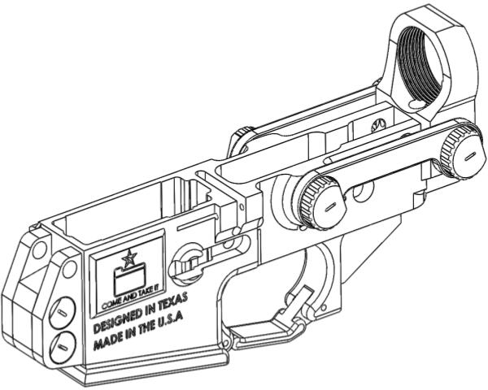
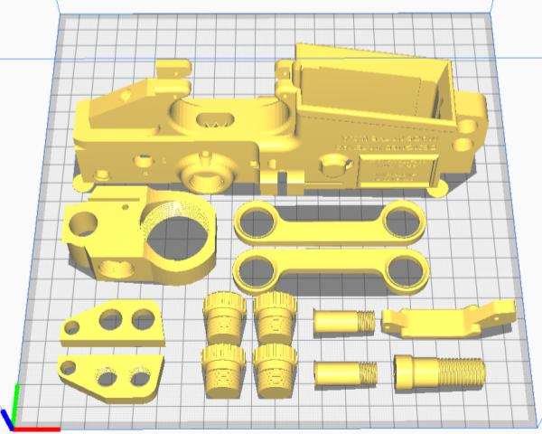
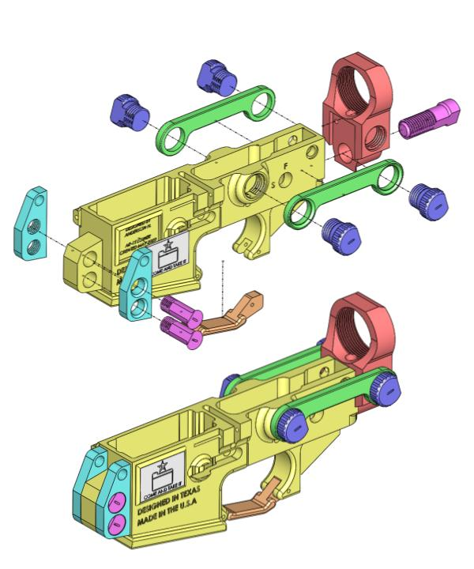
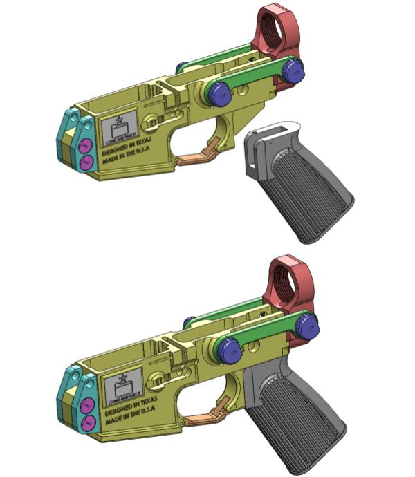
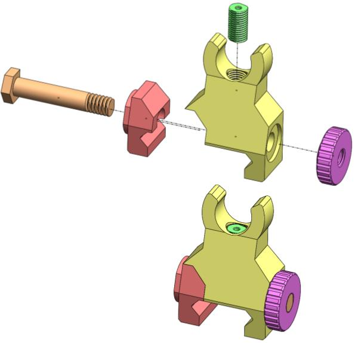
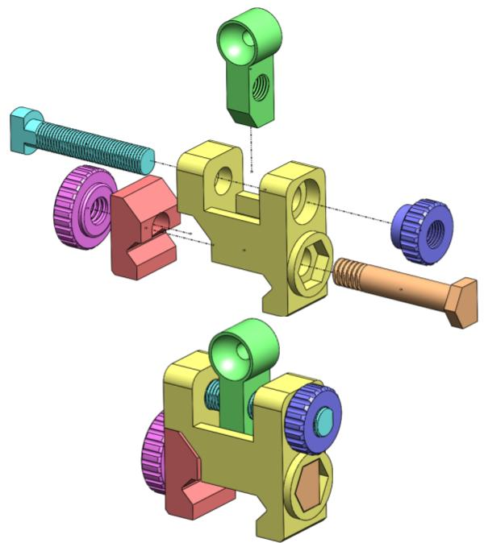
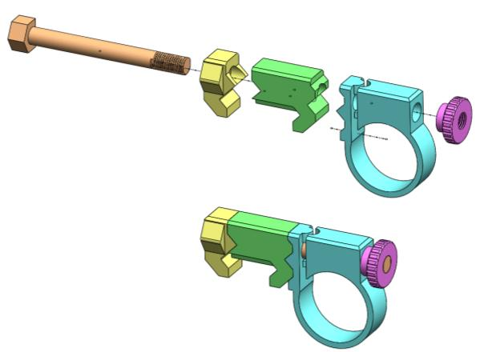
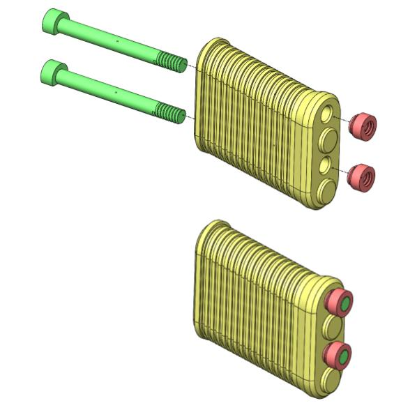
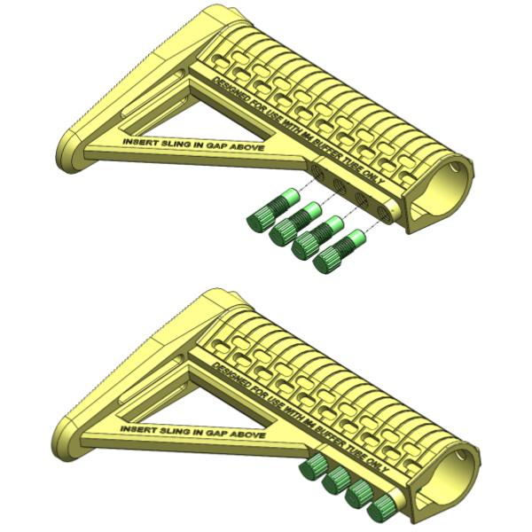
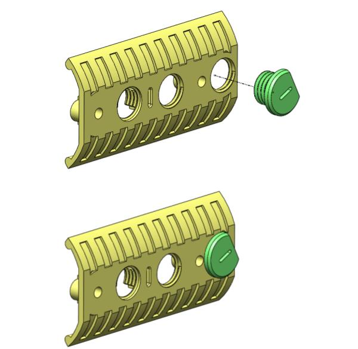

<head>

</head>

<h1>
<andersonFirearms>ANDERSON FIREARMS</andersonFirearms>
</h1>

  

<h2>
OFFICIAL INSTRUCTIONS MANUAL FOR THE MODEL WILDFIRE
</h2>

<h3>
Implementation of the Disposable Biodegradable Armalite Model 15 Rifle Kit
</h3>

<h3>
By Anderson N.
</h3>

---
# OVERVIEW
Hello, and thanks for downloading and supporting the Anderson Firearms Model WildFire. There are some key differences between this design and the previous Ghostfire Model that sparked the sporadic spread and utility of the general AR Platform. There are a lot of housekeeping items we need to go over before you continue, which will answer a lot of questions and prevent y'all from cluttering my communications. First, lets go over what this instruction manual entails:
* **Manufacturing**
* **Assembly**
* **Application**
* **Maintenance**

>**Manufacturing** involves all the big details on how to successfully set up your printer and select the optimal slicer settings for the best print results

>**Assembly** involves how to put these pieces together, including actual AR Lower pieces such as the pins both front and rear, the FCG (Fire Control Group), and the buffer tube. While the accessories are important, their assembly does not require a genius.

>**Application** is how the whole system works, as there are key differences in the manual of arms of custom made 3d printed AR Lowers and accessories.

>**Maintenance** is how to keep your AR rifle in top notch condition. Because we are dealing with 3D printed materials, there are some surprising things I have learned that should be noted when caring for your rifle after excess use.

Now that we have gotten the main contents out of the way, you can go ahead and get started on the official manual! **To get started on your new build, move over and start on the "MANUFACTURING" section.** However, if there are other house keeping items you want to inquire about, ill post them below in subsections.

### MISSION STATEMENT OF THE PROJECT

The mission statement of the project and its purpose is as follows:

> **_
To spread, disseminate, publish, propagate knowledge of manufacturing, transporting, and distributing the concept of expedient homemade firearms. To further the implementation and concept of the Disposable Biodegradable Armalite Model 15 Rifle Kit.
_**

Political objectives are as follows:

> **_
To combat the rise and resurgence of Communist, Marxist, and Socialist forces and actors both foreign and domestic. To radicalize Americans under the pretext of the Constitution. To uphold, maintain, and exert Western Ideology and radical extremist beliefs such as freedom, liberty, and justice. To counter attempts at deconstructing the concept of the United States of America by demoralization, collapse, crisis, and normalization of non-American Ideology. To provide for the common defence of the people under the American Republic, and to supply for the counter offense of oppressed peoples of authoritarian regimes.
_**

Design objectives are as follows:

>**_
To design a rifle kit for the AR-15 platform of rifles, that once outfitted, will enable a user to take this weapon into combat, and out of combat, in optimal condition. To design a rifle to last a minimum of 300 cartridges discharged, and an ideal maximum of 1000 cartridges or more discharged. To design a lower receiver to be compatible with the most commonly available upper receivers with forward assists. To design the entire kit without the use of brims, supports, or any kind of external use of additive manufacturing. To design the entire kit to use PLA/PLA+, the most common and inexpensive filament to use other than ABS.
_**

---
# MANUFACTURING

### Naming convention

Listen carefully, because there is a specific naming convention that I have applied to each file part. These files were named in this way because I picked them up from learning in the field of engineering, and have realized that this convention is very efficient at organizing and specifying exactly what parts or models are what, and that this way, things will get done faster and more orderly.

Here is an example of a file name and all the components of that name:

>**AF-WF-LR-PRT-001-STL.stl**

* **AF** ------> Company or Organization : "**A**nderson **F**irearms"
* **WF** ------> Product or Model: "**W**ild **F**ire"
* **LR** ------> Component: "**L**ower **R**eceiver"
* **PRT** -----> Part
* **001** -----> Numbered Part
* **STL** -----> Type of file, in this case an STL file
  
Heres another example of a file name that is similar but different in other ways:

>**AF-WF-GS-MDL-002-SLDWRKS.sw**

* **AF** ------> Company or Organization: "**A**nderson **F**irearms
* **WF** ------> Product or Model: "**W**ild **F**ire"
* **GS** ------> Component: "**G**host **S**ights"
* **MDL** -----> Model, which consist of parts
* **002** -----> Numbered Model
* **SLDWRKS** ------> Type of file, in this case a SolidWorks File

Now that you got an idea of how the naming convention works, it's time to make sense of the whole system.

### Choosing what to print and what not to

First things first: This is not just a lower; Its a whole system that will convert your AR into a battle-ready rifle. This whole 'kit' is the whole deal, and here's what's inside:

* WildFire Lower
* Adjustable Ghost ring sights, front and rear ("Iron sights")
* Pistol Grip
* Stock
* Keymod only Thermal Covers (Barrel Covers)
* Keymod only Vertical Foregrip
* Flashlight attachment
* Custom Side Plate

Now for some notes:
  
* I only did keymod because thats all I have on my rifle. I would do MLOK, but i'm lazy and only bothered designing what I had in hand. Plus, Keymod is actually open source (correct me if im wrong), which means its friendly for all kinds of stuff.
* You don't have to use everything provided in the kit. If all you want is the lower, be my guest.
* The front sights adjust for elevation, and the rear sights adjust for windage.
* The flashlight attachment only works for flashlights with a one inch diameter. Again this is because I picked the cheapest metal flashlights I can find and simply worked with that.

Select what you want to print, and leave the rest of the files alone. They should be conveniently named after their function. If all you want is to print, look for the STL files of each product you desire. If you want to modify designs for yourself, look into the SolidWorks files, because I used Solidworks to craft this product. There are also STEP files as well for you if you use other CAD software. They all use the same naming convention so they shouldn't be difficult to sort out and use.

### Slicing preferences

During testing, the WildFire Lower was printed at 80% while the rest of the parts were printed at 40% to 60%. However, for safety sake print according to the graph shown below for the best possible results. **All prints were done in PLA, not ABS, not PETG, not Resin method, just plain-o PLA. I cannot guarantee that the kit will work with anything other than PLA, but i'm pretty sure that if it works in PLA, there's a high chance it'll work in ABS or other materials. Let me know what your results look like.**

**Instructions:** In the graph below, print each of the items listed by loading the associated File Name STL into your preferred slicer, assuring that you follow the preferred range of infill, layer lines, and quantity of pieces. Do not load or print any of the files that are not listed below unless you understand what you are doing.

|File Name|Infill %|Layers Lines|Quantity|
| :---: | :---: | :---: |  :---:  |
| AF-WF-LR-PRT-001 | >=60 | 3 | 1 |
| AF-WF-LR-PRT-002 | >=80 | 6 | 1 |
| AF-WF-LR-PRT-003 | 100 | 6 | 1 |
| AF-WF-LR-PRT-004 | 100 | 6 | 1 |
| AF-WF-LR-PRT-005 | 100 | 6 | 1 |
| AF-WF-LR-PRT-006 | 100 | 6 | 2 |
| AF-WF-LR-PRT-007 | >=80 | 6 | 2 |
| AF-WF-LR-PRT-008 | >=80 | 6 | 4 |
| AF-WF-LR-PRT-009 | >=80 | 6 | 1 |
| AF-WF-PG-PRT-001 | >=80 | 3 | 1 |
| ANY CUSTOM SIDE PLATE | >=60 | 3 | 1 |
| AF-WF-GS-MDL-001 | >=60 | 3 | 1 |
| AF-WF-GS-MDL-002 | >=60 | 3 | 1 |
| AF-WF-TC-PRT-001 | 100 | 6 | DEPENDS ON RAIL |
| AF-WF-TC-PRT-002 | 100 | 3 | DEPENDS ON RAIL |
| AF-WF-VF-PRT-001 | >=80 | 3 | 1 |
| AF-WF-VF-MDL-001 | >=80 | 3 | 1 |
| AF-WF-SS-PRT-001 | >=60 | 3 | 1 |
| AF-WF-SS-MDL-001 | 100 | 6 | 4 |

### Printing Preferences
* Do not print with supports
* Try not to use any infill pattern except grid and cubic (I use cubic by the way).
* Do not print with brims (unless you can clean it up)
* Try not to print diagonally on the print bed, unless your print bed is too small. Since I have never tested the results of a part printed diagonally, I can't guarantee its success.
* Orientate the part to print on it's flattest side. Refer to the "Printing Orientation" section below to see the correct orientations.
* Print at temperatures that is most optimal for you. For me, I printed at 190c for PLA, and 210c for PLA+. Your temps could be different.
* All prints were designed to work with the standard 1.75mm filament, no higher, no lower. I can't guarantee the success of 3.25mm filament, but you are welcome to try :)
* Print at your standard layer height (normal), but if you want more details, only the AF-WF-LR-PRT-001 will benefit more from higher detail layer height.
* All of the pieces with bolts were designed to print "sideways." Look into the "Printing Orientation" section below and you will know what I mean.
* Enable combing on all of the pieces. I have tested without combing, and while both have yielded identical results, with combing the pieces were a lot easier to clean. Note that combing will affect appearances, but honestly looks don't matter when it comes to shooting.
* Some parts, such as the Ghost Ring Sights, will come in a model containing all of the pieces conveniently laid flat. This was done so that you can print the entire model in one go, rather than printing each small piece one by one.

### Printing Orientation
When loading the STL's onto the print bed, the orientation matters, and you will have to rotate the pieces, unless the STL files have them orientated correctly already. I have worked with each piece to make sure they are orientated correctly in STL and have loaded them in my preferred slicer (Cura) to double check that they are correct. Ideally you should print on the flattest side, and since there's a specific orientation required for each piece, you will have to refer to the images below to see the orientation required. The only piece that doesn't have a prefered orientation is the Design Plates, and that's because these custom plates are just for you to design and print, however you desire.

  

*
Lower Reciever Orientation 
*

  

*
Assessories Orientation
*

*
Warning: Do not load everything you see into the print bed and just print. It doesn't work like that. These are only references to show you the proper orientation of the pieces.
*

---
# ASSEMBLY

This is the sauce of the build, and will be the most interesting part of the manual. You'll notice that there are no external metal pieces: Great work has been put into ensuring that no external metal pieces are used whatsoever: everything you need to complete the kit comes right off the print bed, and no trip to a local hardware store is ever needed.

### Tools Required

The only tools you will need are the following:

* Pliers
* 4.0 Flat Head Screwdriver (Slotted Screwdriver)
* Lighter or small handheld butane torch
* Steel or brass pin punch (to clean/refine holes for the pivot and takedown pins)
* (Optional) Super Glue or Epoxy Glue
* 1.75mm filament (for use as rivets)
* Any tool you will use to clean built in supports for the file "AF-WF-LR-PRT-001" or parts containing extra stringing

### Standard procedure of assembling (To be used on every step of the way)

1. Clean the part of any excess filament.
2. fix imperfections of pieces using the lighter to refine the piece. The heat will shrink the pieces and eliminate excess filament. Be very careful and go slowly on this step. Take care not to burn the piece or melt it. The heat is to remove excess filament that cant be removed conventionally.
3. On any screws, make sure to screw the piece onto the mating face first before fastening down with other pieces. You want the screws to fit smoothly, and depending on the quality of your printer, this may not always be the case. Use the pliers to bite into the screw for extra leverage in smoothing the screw. If the screws are too tight, unscrew and use the lighter to soften the screw face.
4. *Note:* On any given steps when using the lighter or torch, you should not have to heat up the surface for more than a quarter of a second. Anymore, and you risk deforming it or melting it, and thats not ideal. If you need more heat, use short bursts of heat to control the parts and to avoid permanent damage to the print surface texture.
5. The assembly will come in a form of two images: one will showcase the exploded view of the assembly. The second will showcase the collapsed view of the assembly. As long as you have printed everything, the assembly as a whole should be very simple and uncomplicated. Use the images to reference the assembly of each piece.

### Lower Receiver Assembly

Notes:
* The side rail struts once assembled must be removed to gain access to the rear take-down pin
* Roller Pins should not be used. Instead, insert a string of 1.75mm filament, and heat the ends into the lower, like rivets on an AK. This technique applies only to the bolt release/catch and the trigger guard portion of the lower.
* The design plate was meant to be pressed into the side of the lower. If the fitting is not sufficient, decrease scaling of the design plate if it won't fit, increase scaling of the design plate if it is too loose. Super glue is also applicable.
* For a permanent attachment, the part AF-WF-LR-PRT-005 can be doused with epoxy or super glue and screwed into the main lower. I have done this, but doing this step will remove the possibility of swapping out the buffer tube connector end of the lower, which is the main point of this design. For all testing, I have not glued this part into the lower.

### Pistol Grip Assembly

Notes:
* This grip is compatible on regular aluminum lowers as well.
* The reason for this grip is because some grips sold on the market include the curved top portion of the grip, which is not compatible with this lower reciever.

### Ghost Ring Sights Assembly

Notes:
* All pieces are designed to be compatible with picatinny rail only.
* You will notice that there is no front sight post. This is because you will have to insert a piece of 1.75mm filament into the exposed slot on the front sight post adapter, and straighten the post. This will act as the front sight post notch when using the Ghost Sights.
* Once you finish printing the rear sights, you can refine to diopter aperture by inserting a heated steel/brass punch to refine the hole and make it clear to gain a sight picture.

### Mounted Illumination Assembly

Notes:
* All pieces are designed to be compatible with picatinny rail only
* The Mounted Illumination will only accept flashlights that have a one inch diameter. Mine is 1.025 inches. However, since you have access to the STEP files and the SLDWRKS files, you can modify the files yourselves to match the diameter or any desired flashlight.?

### Vertical Foregrip Assembly

Notes:
* All pieces are designed to be compatible with keymod rail only. See FAQ at the end of the documentation to see why.
* You will notice that the vertical foregrip is too small to grip entirely. That is because this is a foregrip not a standard grip. It is meant for the hands to grapple the rail cover and the grip in between, and yank back into your stock to tighten the hold.

### Standard Stock

 

Notes:
* All pieces are designed to be compatible with M4 buffer tubes only, but if it works with commercial buffer tubes (which has a slighter larger diameter which this design actually meets) let me know.
* This is not designed to be adjustable, because the screws make it impractically so. I will come up with an adjustable solution in future projects.

### Thermal Covers

Notes:
* All pieces are designed to be compatible with keymod rail only. 
* The thermal plates are to be inserted and then slide into fit like a slotted mechanism.
* Once fitted, the thermal covers are fastened into place with the bolt, which is shown in the visual above.
* The plates can be inserted in both orientations, and take up 3 or 3.5 keymod holes depending on the orientation you place them.

---
# APPLICATION

### Manual of Arms and Rules
When the WildFire Lower is assembled correctly, it will function identically to any other AR-15 platform of rifles. To use, make sure you follow all rules of your local range, and to follow the four fundamental rules of firearms:

1. Keep your finger off the trigger until you're ready to fire.
2. Be wary of what you are shooting at and beyond that.
3. All firearms are to be treated as if they're loaded
4. Be wary of where your muzzle is pointing at

### Dry Firing Practice
Once you have memorized the rules, you should be ready to fire. Dry-firing is a good way to practice before shooting. Start by checking if your firearm is loaded, and lock the bolt open. Operate the fire-selector from "F"(Fire) to "S"(Safe). Insert an empty magazine into the lower, practicing the use of your work space to operate the firearm easily. Once inserted, close the bolt. Take aim, ensuring that your finger remains off the trigger. Switch the fire selector to "F"(Fire), and dry fire when the target picture is acquired.

### Magazine Compatibility
The firearm was tested with the following kinds of magazines, all with success:
* PMAGS GEN II
* PMAGS GEN III
* Aluminium magazines with steel butt plates (GI Mags)
* STANAGS (falls under GI Mags)
* MFT Magazines
* Custom spray painted mags (rougher to insert, but worked fine)
* Custom 10rnd PMAGS GEN III

### Mortaring
Mortaring is when a malfunction renders the bolt inoperable by the charging handle, and thus must be forcefully ejected by slamming the stock into the ground while yanking down on the charging handle. That said, mortaring is unfortunately a weakness of this kit, because limitations on the stock means that mortaring of any kind will most likely break not the stock but it's bolts. Thus when mortaring, expect to replace the bolts that are used to secure the stock.

### Zeroing using Ghost Ring Sights
These are essentially diopter sights, and should be treated like the standard iron sights used on the M4/M16 platform of rifles. The difference is that there is only one option instead of flippable long range and short range, and its pretty big compared to the pinholes of other diopter sights. This choice was made because bigger pin holes would allow the eye to acquire a sight picture faster, at the cost of some precision. However, this was also a utilitarian choice: you would still be able to hit man size targets out to 100 yards, and four inch groups at 50 yards. It's not perfect, but it works.

To zero the sights, the front post adjusts for elevation, while the rear post adjusts for windage. Here's how I adjust my sights:
1. Attach the front and rear sights onto the upper, and boresight the sights at 25 yards.
2. Once boresighted, assemble the AR, load 3 cartridges, and fire directly at bullseye at 25 yards.
3. Observe the shot group, and make adjustments if necessary, with each adjustment following another 3 cartridges until the group is directly over the bullseye.
4. Place the weapon at the 50 yard mark, and repeat the tests, ensuring that the shot placement can consistantly hit a man size target.

The idea is not to get headshots or bullseyes. The idea is to be able to reliably hit man size targets should you touch out to 100 or even 200 yards. One thing you should note is that this device was never tested out to 100 yards, but tests at 50 yards showed that the sights can hold zero. This was a limitation of the ranges I have been to, so if I had the option to shoot out to 100, I would have.

### Testing
This is a big part of all of my devices: To ensure that they're tested to work and work reliably in the field. The purpose of this test is to show that my lower can withstand 300 rounds, and if so, you may test further to see how much cartridges you can expend before failure or seizure. That said, my testing was done through 2 trips to the range with a friend and we blasted 300 rounds without major malfunctions and issues. We had only ever encountered one failure to feed on the first cartridge of a fully loaded magazine when racking the charging handle, and the bolt did not pick up a round. I later discovered that the malfunction was not caused by the lower, but by the magazine, which was an aluminum STANAG. This magazine was given to me because another friend who used it reported issues with it when shooting 300 BLKOUT with this magazine. Other than that, the lower experienced no issues, and chugged 300 cartridges without any malfunction or breakage. Note that in between range trips one and two, the only major change to the lower was a reprint of a better and more ergonomic pistol grip. The new grip was a far superior design in terms of comfort and gripability. Overall a huge success. Photos will be attached below to showcase testing.

---
# MAINTENANCE

### Basic Cleaning
For the most part, the upper receiver will be cleaned normally, as the lower was found to leave no plastic residue that required anything else to be cleaned. The lower however, will have to be cleaned as frequently as the upper. Previously, metal lowers do not need to be maintained at all like the uppers because residue does not impact the Fire Control Group's ability to function. Because PLA is printed in layers, excess carbon can build up in between layers and would increase friction on the fire control group, which may impact the ability for the trigger to function. I say maybe because I have never experienced the trigger failing to function, but have noted that as carbon begins to build up in excess of 200 rounds during testing, the trigger pull was in fact heavier, but it continues to function as intended. When cleaning the lower, focus on wiping carbon off the magazine well, as well as carbon imparted on the hammer, and the inside well of the fire control group. You do not need to disassemble to the Fire Control Group, just wipe any spots with carbon on them. Note that carbon will be imprinted onto the lower, and thus cannot be removed completely.

### Advance Cleaning (Must read)
There is one major instance where a full breakdown and clean is required: When the weapon is deployed in adverse conditions (rain and mud). This means disassembling the Fire Control Group and wiping the section dry. What I notice is that rust can rapidly develop in the lower. To be frank, I'm not sure why, but I would assume the reason boils down to some property of layers and PLA retaining moisture which means a through clean is required. This is something that I'm very adamant about: clean the gun after you get water in it. Im certain that this rule also applies to conventional aluminum lowers, but more so on these WildFire Lowers.

### Replacing parts
The WildFire was designed to blast through a clean 1000 cartridges, and then have the buffer tube connector and support struts replaced. Rather than printing the whole lower everytime it fails, this design allows you to only print the parts you need to replace, and not the whole lower each time. This saves a lot of material, time, and allows you to bring replacement parts on the field to repair it in the field, although this should not be necessary. This design was also done to take advantage of increased structural strength by allowing the normal force of the Bolt Carrier Group to act against layer lines, not with it. You will know that this means when you print and realize that the adhesion of layer lines is the real flaw of a printed piece's ability to withstand compression and tension, and that the orientation of the printed pieces eliminates this possibility. Replace pieces if necessary when enough rounds (1000) have been put through them, or when cracks and heat warping is observed.
 

---

# FAQ's and inquiries

#### Differences between this build and the Ghostfire model
The biggest revolution of this build and the Ghostfire model is the no metal no nonsense philosophy. This means that other than the standard AR Build Kit, there are no external nut, bolt, washer, or metal of any kind! This means you don't need to visit the hardware store to get this build into action. No nonsense also means that you do not need to implement any form of 3D Printed tricks of any kind, nor any supports, and because this was entirely designed around the use of PLA, virtually any 3D printed material is compatible with this design. No modification of anything at all, just slap the files on your slicer, and rock n' roll. The design was even tested at 40-80% infill, to ensure that even at its weakest and worse, it could still run. All needed supports are already built into the design, which means you don't need to add your own. Because of the small size of each print, these parts are certain to fit smaller print beds. No nonsense, no stupidity, idiot proof, almost marine grunt proof.

#### Why did you build and design these lowers?
Because printer go brrrrrrr.

#### Plausible Deniability
Because this has to be said: You print it, thus you are responsible for its outcome. Under no circumstances am I held responsible should this design go south. However, as you will know, I did in fact check and test my designs and provided proof of these checks and tests to show that the design works. The proof will be found in the Application section, where I will detail the results of long term extreme testing, and the optimal round count before recommended replacement of certain parts, or the whole lower. You have been warned.

On another serious note, any mass killing, mass shooting, or mass (insert illegal crime here) caused by this device is not my fault or intention. I have never designed and intended for this device to be used as a means to an end of a violent crime or violent acts. What you do with my knowledge is your responsibility.

#### On the note regarding private sales
Anyone who tries to sell you this device or the knowledge to sell you this device is ripping you off. This device is of open domain, so unless you don't own a printer and need to buy one from a friend for educational purposes, you're being ripped off. That said, follow your local laws and make sure you understand what manufacturing entails.

#### Will there be future models?
Yes. The next model(s) are going to:
* Provide a functional lower for AR-10 platform (yessssss, also most likely for DPMS AR-10.)
* Unobtruded access to the fire selector and rear take-down pin
* Select Fire (maybe, depends on if I can hide from the FBI)
* Experimental PLA only suppressor (Thanks to my incredible experience, I may know how to get this idea to work. Also depends on if I can hide from both the ATF and the FBI.)
* Provide a website for all of this (maybe, if this becomes bigger than just me.)
* 22Lr single shot multi use pistol (if it's fun enough, sure)
* Beer Cannon, because rednecks in Texas need an efficient method of transporting beer. Also depends on if I can hide from the FBI AND the ATF.
* Device to crimp 5.56 and .223 casing to be used as blanks just for the beer cannon.

#### How can I support your work?
By printing this lower, duhhh.
